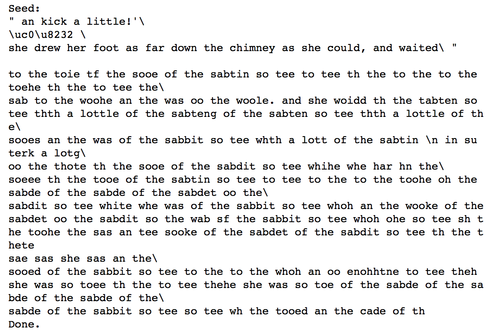

# LSTM-Text-Generator

Overview
========
This project is to generate new text by training a LSTM network on an existing text.

Dependencies
========
* Numpy(http://www.numpy.org/)
* Keras ```pip3 install keras```

Data Preprocessing
=========
The text used to train the data is Alice's Adventures in Wonderland by Lewis Carrol (http://www.gutenberg.org/cache/epub/11/pg11.txt). There is not test data set has the objective is not to predict and recreate the existing text. The characters are mapped to integers so to have suitable inputs to the network. The input data is normalised and the output data is one hot encoded. 

LSTM
=========
This is a very basic LSTM model to get familiar with creating them. The LSTM network takes input of 100 characters. The network predicts the next character. The next input will be the previous 99 characters plus the character that was just predicted. The dropout rate is 20%. 

Results
========
The LSTM achieved a categorical cross entropy loss of 1.86. The model cannot yet create comprehensible text. Having the model train for more than 20 epochs could improve the model. 



Acknowledgements
========
This project is completed with the help of a tutorial https://machinelearningmastery.com/text-generation-lstm-recurrent-neural-networks-python-keras/
